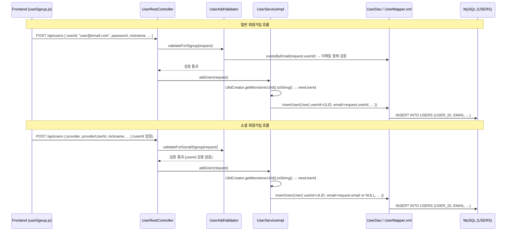
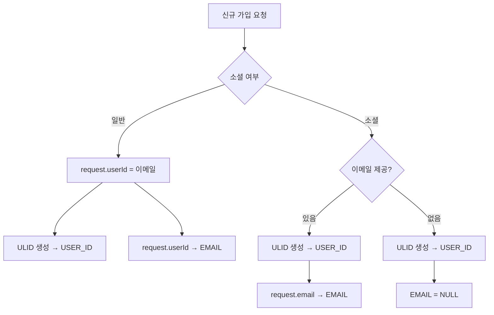

# Design Document: user-identity-refactor

## Overview

현재 USERS 테이블의 `USER_ID`는 PK이자 이메일 식별자를 겸하고 있어, 소셜 로그인 시 `kakao_12345678` 형식의 값이 혼재하는 구조적 문제가 있다.

이 설계는 세 가지 핵심 변경을 통해 문제를 해결한다:

1. **USER_ID → ULID**: 신규 가입자부터 26자 ULID를 식별자로 사용 (기존 유저 USER_ID 불변)
2. **EMAIL 컬럼 분리**: USERS 테이블에 `EMAIL VARCHAR(100) NULL UNIQUE` 추가, Flyway V10으로 기존 데이터 마이그레이션
3. **비밀번호 찾기 쿼리 변경**: `findByUserId` → `findByEmail` 기준으로 전환

기존 유저는 영향 없이 기존 USER_ID로 계속 로그인 가능하며, 신규 가입자부터 새 구조가 적용된다.

---

## Architecture





---

## Components and Interfaces

### 백엔드

**pom.xml**
- `com.github.f4b6a3:ulid-creator:5.2.3` 의존성 추가

**Flyway V10__add_email_column.sql**
```sql
ALTER TABLE USERS ADD COLUMN EMAIL VARCHAR(100) NULL UNIQUE;

UPDATE USERS SET EMAIL = USER_ID WHERE USER_ID LIKE '%@%';
-- kakao_*, google_* 형식은 EMAIL = NULL 유지 (기본값)
```

**User.java**
- `private String email;` 필드 추가

**UserCreateRequest.java**
- `@NotBlank` 제거 (userId는 소셜 가입 시 불필요)
- `private String email;` 필드 추가 (소셜 가입 시 OAuth에서 받은 이메일 전달용)

**UserResponse.java**
- `private String email;` 필드 추가
- `UserResponse.from(User user)` 팩토리 메서드에서 `email` 포함

**UserAddValidator.java**

| 메서드 | 변경 내용 |
|--------|-----------|
| `validateForSignup` | `validateEmailDuplicate(userId)` → `existsByEmail(userId)` 기준으로 변경, 이메일 형식 검증 추가 |
| `validateForSocialSignup` | userId 관련 검증 로직 제거 |
| `validateEmailDuplicate` | `existsByUserId` → `existsByEmail` 호출로 변경 |

**UserServiceImpl.java**

`addUser()` 메서드 변경:
```java
// 변경 전
String userId = request.getUserId().toLowerCase();

// 변경 후
String userId = UlidCreator.getMonotonicUlid().toString();
String email = isSocial ? request.getEmail() : request.getUserId();
```

`startPasswordReset()` 메서드 변경:
```java
// 변경 전
User user = userDao.findByUserId(request.getUserId())...

// 변경 후
User user = userDao.findByEmail(request.getUserId())
    .orElseThrow(() -> new BusinessException(ErrorCode.NOT_FOUND, "사용자를 찾을 수 없습니다."));
```

**UserDao.java**
```java
Optional<User> findByEmail(@Param("email") String email);
int existsByEmail(@Param("email") String email);
```

**UserMapper.xml**
- `resultMap` → `<result property="email" column="EMAIL" />` 추가
- `insertUser` → `EMAIL` 컬럼 및 `#{email}` 값 추가
- `findByEmail` 쿼리 추가
- `existsByEmail` 쿼리 추가

### 프론트엔드

**useSignup.js**

소셜 가입 payload에서 `userId` 필드 제거:
```js
// 변경 전
const payload = isSocial ? {
  provider: socialInfo.provider,
  providerUserId: socialInfo.providerUserId,
  userId: socialInfo.email || `${socialInfo.provider}_${socialInfo.providerUserId}`,
  ...
}

// 변경 후
const payload = isSocial ? {
  provider: socialInfo.provider,
  providerUserId: socialInfo.providerUserId,
  email: socialInfo.email || null,   // 소셜 이메일은 email 필드로 전달
  ...
}
```

---

## Data Models

### USERS 테이블 변경 (Flyway V10)

| 컬럼 | 타입 | 변경 |
|------|------|------|
| USER_ID | VARCHAR(26) | 기존 유지, 신규는 ULID |
| EMAIL | VARCHAR(100) NULL UNIQUE | **신규 추가** |

> 기존 USER_ID가 VARCHAR(50)이므로 ULID 26자는 여유 있게 수용된다.

### 데이터 마이그레이션 규칙

| 기존 USER_ID 형식 | EMAIL 컬럼 처리 |
|-------------------|-----------------|
| `user@example.com` (`@` 포함) | USER_ID 값을 EMAIL로 복사 |
| `kakao_12345678` | NULL 유지 |
| `google_abcdef` | NULL 유지 |
| 신규 ULID | 가입 시 email 필드 값 저장 |

### User 도메인 객체

```java
public class User {
    private String userId;      // ULID (신규) 또는 기존 형식
    private String email;       // 신규 필드: 이메일 주소 (nullable)
    private String password;
    private String nickname;
    private String phone;
    // ... 기존 필드 유지
    private String provider;    // 소셜 유저 판별용 유지
}
```

### UserCreateRequest

```java
public class UserCreateRequest {
    // @NotBlank 제거 - 소셜 가입 시 userId 불필요
    private String userId;          // 일반 가입: 이메일 입력값 (하위 호환)
    private String email;           // 소셜 가입: OAuth 이메일 전달용
    private String password;
    private String passwordConfirm;
    private String nickname;
    private String phone;
    private boolean agreeMarketing;
    private String provider;
    private String providerUserId;
}
```

---

## Correctness Properties

*A property is a characteristic or behavior that should hold true across all valid executions of a system — essentially, a formal statement about what the system should do. Properties serve as the bridge between human-readable specifications and machine-verifiable correctness guarantees.*

이 피처는 순수 비즈니스 로직(ULID 생성, 이메일 저장, 조회)을 포함하므로 property-based testing이 적합하다. 테스트 라이브러리는 기존 프로젝트에 이미 포함된 **jqwik**을 사용한다.

### Property 1: 신규 가입 시 USER_ID는 항상 ULID 형식이다

*For any* 유효한 신규 가입 요청(일반 또는 소셜)에 대해, UserService가 생성하여 저장하는 USER_ID는 반드시 26자이고 Crockford Base32 문자셋(`[0-9A-HJKMNP-TV-Z]{26}`)을 따라야 하며, 요청 본문의 userId 필드 값과 달라야 한다.

**Validates: Requirements 1.1, 1.2, 1.3**

### Property 2: 일반 가입 시 EMAIL 컬럼에는 요청의 userId 값이 저장된다

*For any* 유효한 이메일 형식의 userId를 포함한 일반 가입 요청에 대해, 저장된 User의 email 필드는 요청의 userId 값(소문자 정규화 후)과 동일해야 한다.

**Validates: Requirements 3.1, 3.2**

### Property 3: 이메일 형식이 아닌 userId는 일반 가입 검증에서 거부된다

*For any* 이메일 형식(`@` 미포함 또는 형식 불일치)의 문자열을 userId로 포함한 일반 가입 요청에 대해, UserAddValidator는 BusinessException을 발생시켜야 한다.

**Validates: Requirements 3.3**

### Property 4: 소셜 가입 시 이메일 제공 여부에 따라 EMAIL 컬럼이 올바르게 저장된다

*For any* 소셜 가입 요청에 대해, 이메일이 제공된 경우 EMAIL 컬럼은 해당 이메일 값이어야 하고, 이메일이 없는 경우 EMAIL 컬럼은 NULL이어야 한다.

**Validates: Requirements 4.1, 4.2**

### Property 5: EMAIL 컬럼 기준 비밀번호 찾기 조회는 올바른 유저를 반환한다

*For any* EMAIL 컬럼에 이메일이 저장된 유저에 대해, 해당 이메일로 findByEmail을 호출하면 동일한 USER_ID를 가진 유저가 반환되어야 한다.

**Validates: Requirements 6.1, 6.3**

### Property 6: UserResponse.from()은 User의 email 필드를 그대로 노출한다

*For any* email 값을 가진 User 객체에 대해, UserResponse.from(user)의 결과 email 필드는 user.getEmail()과 동일해야 한다.

**Validates: Requirements 8.3**

---

## Error Handling

| 상황 | 예외 | HTTP |
|------|------|------|
| 일반 가입 시 이메일 형식 오류 | `BusinessException(VALIDATION_ERROR)` | 400 |
| 일반 가입 시 EMAIL 중복 | `BusinessException(CONFLICT)` | 409 |
| 소셜 가입 시 EMAIL 중복 | `BusinessException(CONFLICT)` | 409 |
| 비밀번호 찾기 시 EMAIL 미존재 | `BusinessException(NOT_FOUND)` | 404 |
| 소셜 인증 정보 누락 | `BusinessException(VALIDATION_ERROR)` | 400 |

**하위 호환성**: 기존 유저의 USER_ID가 이메일 형식인 경우, V10 마이그레이션이 해당 값을 EMAIL 컬럼으로 복사하므로 `findByEmail`로 정상 조회된다. 기존 로그인 흐름(`findByUserId`)은 변경 없이 유지된다.

---

## Testing Strategy

### 단위 테스트 (JUnit 5 + Mockito)

- `UserAddValidator`: 이메일 형식 검증, 소셜 가입 시 userId 검증 미수행, 중복 이메일 거부
- `UserServiceImpl.addUser()`: ULID 생성 확인, email 필드 세팅 확인, 소셜/일반 분기 처리
- `UserResponse.from()`: email 필드 포함 여부

### Property-Based 테스트 (jqwik)

프로젝트에 이미 `net.jqwik:jqwik:1.8.2`가 포함되어 있으므로 별도 의존성 추가 없이 사용한다.

각 property 테스트는 최소 100회 반복(`@Property(tries = 100)`)으로 실행하며, 태그 형식은 다음과 같다:

```
// Feature: user-identity-refactor, Property N: <property_text>
```

| Property | 테스트 대상 | 생성 전략 |
|----------|-------------|-----------|
| Property 1 | `UserServiceImpl.addUser()` | 임의 닉네임/이메일/전화번호 조합 |
| Property 2 | `UserServiceImpl.addUser()` (일반) | 유효한 이메일 형식 문자열 생성 |
| Property 3 | `UserAddValidator.validateForSignup()` | 이메일 형식이 아닌 임의 문자열 |
| Property 4 | `UserServiceImpl.addUser()` (소셜) | 이메일 있음/없음 두 케이스 |
| Property 5 | `UserDao.findByEmail()` | 임의 이메일로 유저 생성 후 조회 |
| Property 6 | `UserResponse.from()` | 임의 email 값을 가진 User 객체 |

### 통합 테스트

- Flyway V10 마이그레이션 실행 후 EMAIL 컬럼 존재 및 기존 데이터 복사 확인 (H2 in-memory)
- 기존 USER_ID 형식 유저의 로그인 흐름 유지 확인

### 마이그레이션 검증 체크리스트

- [ ] `@` 포함 USER_ID → EMAIL 복사 확인
- [ ] `kakao_*`, `google_*` USER_ID → EMAIL = NULL 확인
- [ ] EMAIL UNIQUE 제약 위반 없음 확인 (기존 데이터에 중복 이메일 없는지 사전 확인 필요)
