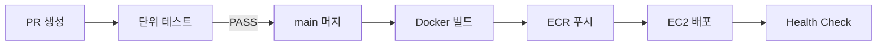

# MOA 리팩토링 마스터 플랜

> **작성일**: 2026-03-25
> **목적**: 부트캠프 졸업 프로젝트 → 취업 포트폴리오 수준으로 완성
> **기술 스택**: Spring Boot 3.5 / MyBatis / MySQL / React / AWS EC2+RDS / Docker / GitHub Actions

---

## 전체 로드맵

```
Phase 1  코드 신뢰성 확보 및 문서화    ← 현재 단계
Phase 2  인프라 구성 및 자동화 (DevOps)
Phase 3  기능 고도화 & 프론트엔드 최적화
Phase 4  포트폴리오 최종 마감
```

---

## Phase 1 — 코드 신뢰성 확보 및 문서화

> **목표**: 코드베이스를 CI/CD 파이프라인에 올릴 수 있는 수준으로 다듬는다.

### 1-1. 단위 테스트 `HIGH`

**현황**: 테스트 의존성(JUnit5, Mockito, H2, jqwik)은 설정됨. 테스트 파일 0개.
**전략**: MyBatis 아키텍처이므로 DAO를 Mockito로 Mock, Service 비즈니스 로직만 단위 테스트.

#### 파일 구조

```
src/test/java/com/moa/
  settlement/service/SettlementServiceTest.java
  payment/service/PaymentRetryServiceTest.java
  deposit/service/DepositServiceTest.java
  party/service/PartyServiceTest.java
```

#### 기본 테스트 클래스 패턴

```java
@ExtendWith(MockitoExtension.class)
class SettlementServiceTest {

    @InjectMocks private SettlementServiceImpl settlementService;
    @Mock private SettlementDao settlementDao;
    @Mock private PartyDao partyDao;
    @Mock private PaymentDao paymentDao;

    @Nested
    @DisplayName("정산 금액 계산")
    class CalculateSettlement { ... }
}
```

#### 테스트 케이스 명세

**`SettlementServiceTest` — 정산 금액 계산**

| 테스트 | 입력 | 기대 결과 |
|--------|------|----------|
| 4인 파티 정산 수수료 계산 | 4명 × 3,625원 = 14,500원 | 수수료 2,175원 / 정산 12,325원 |
| 인원 감소 파티 정산 | 3명 × 3,475원 = 10,425원 | 수수료 1,563원(floor) / 정산 8,862원 |
| 파티장 계좌 미등록 시 상태 | ACCOUNT_ID = null | SETTLEMENT_STATUS = PENDING_ACCOUNT |
| 동일 월 중복 정산 요청 | 이미 COMPLETED인 정산 | BusinessException 발생 |

**`PaymentRetryServiceTest` — 재시도 흐름**

| 테스트 | 입력 | 기대 결과 |
|--------|------|----------|
| 1회 실패 → 재시도 예약 | ATTEMPT_NUMBER = 1, FAILED | NEXT_RETRY_DATE = D+2 설정 |
| 2회 실패 → 재시도 예약 | ATTEMPT_NUMBER = 2, FAILED | NEXT_RETRY_DATE = D+5 설정 |
| 3회 최종 실패 | ATTEMPT_NUMBER = 3, FAILED | NEXT_RETRY_DATE = null, 강제탈퇴 이벤트 발행 |
| 재시도 성공 | ATTEMPT_NUMBER = 2, SUCCESS | RETRY_STATUS = SUCCESS, NEXT_RETRY_DATE = null |
| 최대 횟수(4회) 초과 방어 | ATTEMPT_NUMBER = 5 | BusinessException 발생 |

**`DepositServiceTest` — 보증금 상태 전이**

| 테스트 | 입력 | 기대 결과 |
|--------|------|----------|
| 파티 정상 종료 시 환불 | PARTY_STATUS = CLOSED | DEPOSIT_STATUS = REFUNDED, REFUND_AMOUNT = 5,000 |
| 중도 탈퇴 시 몰수 | MEMBER_STATUS = WITHDRAWN | DEPOSIT_STATUS = FORFEITED, REFUND_AMOUNT = null |
| 파티 취소 시 리더 환불 | PARTY_STATUS = CANCELLED | DEPOSIT_STATUS = REFUNDED, REFUND_AMOUNT = 20,000 |
| 이미 환불된 보증금 재환불 | DEPOSIT_STATUS = REFUNDED | BusinessException 발생 |

**`PartyServiceTest` — 파티 상태 전이**

| 테스트 | 입력 | 기대 결과 |
|--------|------|----------|
| 4인 모집 완료 → ACTIVE 전환 | CURRENT_MEMBERS = MAX_MEMBERS | PARTY_STATUS = ACTIVE |
| 최대 인원 초과 가입 시도 | CURRENT_MEMBERS = 4 (MAX) | BusinessException 발생 |
| 이미 가입된 파티 재가입 | 동일 PARTY_ID + USER_ID | BusinessException 발생 |
| 중도 탈퇴 처리 | leaveParty() 호출 | CURRENT_MEMBERS - 1, MEMBER_STATUS = WITHDRAWN |
| 모집 기간 만료 취소 | 현재 시각 > 모집 마감 | PARTY_STATUS = CANCELLED |

#### 완료 기준
- [ ] `mvn test` 실행 시 전체 테스트 GREEN
- [ ] 핵심 4개 Service 클래스 테스트 완료
- [ ] 각 테스트에 `@DisplayName` 한국어 명시

---

### 1-2. Flyway DB 마이그레이션 `MEDIUM`

**현황**: 스키마 및 샘플 데이터를 수동 SQL 실행 중.
**목표**: 앱 구동 시 DB 스키마 자동 적용, 배포 환경 재현 가능.

#### pom.xml 추가

```xml
<dependency>
    <groupId>org.flywaydb</groupId>
    <artifactId>flyway-core</artifactId>
</dependency>
<dependency>
    <groupId>org.flywaydb</groupId>
    <artifactId>flyway-mysql</artifactId>
</dependency>
```

#### 파일 구조

```
src/main/resources/
  db/
    migration/
      V1__init_schema.sql      ← moa_schema (CREATE TABLE 전체)
      V2__seed_codes.sql       ← COMMUNITY_CODE, PUSH_CODE, BANK_CODE, CATEGORY, PRODUCT
    testdata/
      R__sample_data.sql       ← Phase 1~6 샘플 데이터 (local/test 환경만, 반복 실행)
```

#### 환경별 Flyway 경로 분리

```properties
# application.properties (prod/staging)
spring.flyway.locations=classpath:db/migration
spring.flyway.baseline-on-migrate=true

# application-local.properties (개발)
spring.flyway.locations=classpath:db/migration,classpath:db/testdata
```

#### V2 seed 데이터 범위

- `COMMUNITY_CODE` (10건): INQUIRY 3종 / POST 7종
- `PUSH_CODE` (27건): 커뮤니티/파티/결제/보증금/정산/오픈뱅킹 템플릿
- `BANK_CODE`: 오픈뱅킹 은행 코드
- `CATEGORY` + `PRODUCT`: OTT 서비스 카탈로그

#### 완료 기준
- [ ] 앱 구동 로그에 `Successfully applied N migrations` 출력
- [ ] 수동 SQL 파일 실행 없이 환경 재구성 가능
- [ ] `flyway_schema_history` 테이블로 이력 관리 확인

---

### 1-3. Swagger / SpringDoc OpenAPI `HIGH`

**목표**: `/swagger-ui.html` 에서 전체 API를 탐색하고 직접 호출 가능.

#### pom.xml 추가

```xml
<dependency>
    <groupId>org.springdoc</groupId>
    <artifactId>springdoc-openapi-starter-webmvc-ui</artifactId>
    <version>2.5.0</version>
</dependency>
```

#### SwaggerConfig.java 생성

```
src/main/java/com/moa/global/config/SwaggerConfig.java
```

```java
@Configuration
public class SwaggerConfig {

    @Bean
    public OpenAPI moaOpenAPI() {
        return new OpenAPI()
            .info(new Info()
                .title("MOA API")
                .description("OTT 구독 파티 플랫폼 MOA REST API")
                .version("v1.0.0"))
            .addSecurityItem(new SecurityRequirement().addList("Bearer"))
            .components(new Components()
                .addSecuritySchemes("Bearer",
                    new SecurityScheme()
                        .type(SecurityScheme.Type.HTTP)
                        .scheme("bearer")
                        .bearerFormat("JWT")));
    }
}
```

#### application.properties 추가

```properties
springdoc.swagger-ui.path=/swagger-ui.html
springdoc.api-docs.path=/v3/api-docs
springdoc.swagger-ui.tags-sorter=alpha
springdoc.swagger-ui.operations-sorter=alpha
```

#### SecurityConfig 수정

```java
.requestMatchers(
    "/swagger-ui/**",
    "/swagger-ui.html",
    "/v3/api-docs/**"
).permitAll()
```

#### 어노테이션 적용 우선순위

| 우선순위 | Controller | 이유 |
|---------|-----------|------|
| 1 | `PaymentRestController` | 결제 흐름 핵심 |
| 2 | `PartyRestController` | 파티 CRUD 핵심 |
| 3 | `SettlementRestController` | 정산 흐름 |
| 4 | `DepositRestController` | 보증금 흐름 |
| 5 | `AuthRestController` | 인증 진입점 |
| 나머지 | — | springdoc 자동 스캔으로 커버 |

#### 완료 기준
- [ ] `/swagger-ui.html` 접속 시 전체 API 목록 출력
- [ ] JWT Bearer 토큰으로 Swagger에서 직접 API 호출 가능
- [ ] 핵심 5개 Controller에 `@Tag`, `@Operation` 어노테이션 적용

---

### 1-4. Spring Actuator `MEDIUM`

**목표**: `/actuator/health` 로 서버 상태 확인 (이후 CI/CD 배포 완료 검증에 사용).

#### pom.xml 추가

```xml
<dependency>
    <groupId>org.springframework.boot</groupId>
    <artifactId>spring-boot-starter-actuator</artifactId>
</dependency>
```

#### application.properties 추가

```properties
management.endpoints.web.exposure.include=health,info
management.endpoint.health.show-details=when-authorized
management.endpoint.health.probes.enabled=true
management.info.app.name=MOA
management.info.app.version=1.0.0
management.info.app.description=OTT 구독 파티 플랫폼
```

#### SecurityConfig 수정

```java
.requestMatchers("/actuator/health").permitAll()
```

#### 완료 기준
- [ ] `GET /actuator/health` → `{"status":"UP"}` 응답
- [ ] DB 연결 상태가 health 응답에 포함 (`db.status: UP`)

---

### Phase 1 작업 순서

```
Step 1  Actuator 설정       (15분)  — 독립적, 가장 빠름
Step 2  Swagger 설정        (1시간) — 독립적
Step 3  Flyway 설정         (3시간) — V1 스키마 이관이 핵심
Step 4  단위 테스트 작성    (6시간) — 가장 시간 소요, 핵심
```

### Phase 1 완료 기준

| 항목 | 검증 방법 |
|------|---------|
| 단위 테스트 | `mvn test` → BUILD SUCCESS |
| Flyway | 앱 재구동 후 DB 자동 세팅 확인 |
| Swagger | `/swagger-ui.html` 브라우저 접근 |
| Actuator | `curl /actuator/health` → `status: UP` |

---

## Phase 2 — 인프라 구성 및 자동화 (DevOps)

> **목표**: Phase 1에서 완성한 코드를 자동으로 빌드·테스트·배포하는 파이프라인을 구축한다.

### 2-1. Docker + docker-compose `HIGH`

**목표**: 애플리케이션과 연관 스택을 컨테이너로 묶어 어디서나 동일한 환경 재현.

#### 파일 구조

```
moa/
  4beans-moa-backend/
    Dockerfile
  4beans-moa-front/
    Dockerfile
  docker-compose.yml         ← 로컬 개발용 (MySQL 포함)
  docker-compose.prod.yml    ← 운영용 (RDS 사용, MySQL 제외)
```

#### 백엔드 Dockerfile

```dockerfile
# Stage 1: Build
FROM maven:3.9-eclipse-temurin-17 AS builder
WORKDIR /app
COPY pom.xml .
RUN mvn dependency:go-offline -B
COPY src ./src
RUN mvn package -DskipTests

# Stage 2: Run
FROM eclipse-temurin:17-jre-alpine
WORKDIR /app
COPY --from=builder /app/target/*.war app.war
EXPOSE 8080
ENTRYPOINT ["java", "-jar", "app.war"]
```

#### 프론트엔드 Dockerfile

```dockerfile
# Stage 1: Build
FROM node:20-alpine AS builder
WORKDIR /app
COPY package*.json .
RUN npm ci
COPY . .
RUN npm run build

# Stage 2: Serve
FROM nginx:alpine
COPY --from=builder /app/dist /usr/share/nginx/html
COPY nginx.conf /etc/nginx/conf.d/default.conf
EXPOSE 80
```

#### docker-compose.yml (로컬 개발)

```yaml
services:
  mysql:
    image: mysql:8.0
    environment:
      MYSQL_DATABASE: moa
      MYSQL_ROOT_PASSWORD: ${DB_ROOT_PASSWORD}
    ports:
      - "3306:3306"
    volumes:
      - mysql_data:/var/lib/mysql

  backend:
    build: ./4beans-moa-backend
    ports:
      - "8080:8080"
    environment:
      SPRING_PROFILES_ACTIVE: prod
      DB_URL: jdbc:mysql://mysql:3306/moa
    depends_on:
      - mysql

  frontend:
    build: ./4beans-moa-front
    ports:
      - "80:80"
    depends_on:
      - backend

volumes:
  mysql_data:
```

#### 완료 기준
- [ ] `docker-compose up` 한 명령으로 전체 스택 구동
- [ ] 멀티 스테이지 빌드로 이미지 크기 최소화
- [ ] `.env` 파일로 민감 정보 분리

---

### 2-2. AWS 인프라 구성 (EC2 + RDS) `HIGH`

**목표**: 운영 서버 환경 구성.

#### 아키텍처

```
인터넷
  │
  ▼
[ALB] Application Load Balancer  (HTTPS 443 → HTTP 80)
  │
  ▼
[EC2] t3.micro / Amazon Linux 2023
  ├── Docker: frontend (nginx:80)
  └── Docker: backend (Spring Boot:8080)
  │
  ▼
[RDS] MySQL 8.0 / db.t3.micro   (프라이빗 서브넷)
```

#### 보안 그룹 설계

| 이름 | Inbound | 설명 |
|------|---------|------|
| sg-alb | 0.0.0.0/0:443, :80 | 외부 트래픽 수신 |
| sg-ec2 | sg-alb:80 | ALB에서만 접근 허용 |
| sg-rds | sg-ec2:3306 | EC2에서만 DB 접근 |

#### 주요 작업 목록
- [ ] VPC / 서브넷 / 인터넷 게이트웨이 설정
- [ ] EC2 인스턴스 생성 및 Docker 설치
- [ ] RDS MySQL 생성 (프라이빗 서브넷)
- [ ] ALB 생성 및 HTTPS 인증서 연결 (ACM)
- [ ] Route 53 도메인 연결 (또는 EC2 퍼블릭 IP 직접 사용)
- [ ] `.env` 운영 환경 변수 EC2에 설정

---

### 2-3. GitHub Actions CI/CD `HIGH`

**목표**: PR → 테스트 → 빌드 → AWS 배포 자동화.

#### 파이프라인 흐름

```
PR 생성
  └─▶ [CI] 단위 테스트 실행
         ├── FAIL → PR 머지 차단
         └── PASS → main 머지 허용
                └─▶ [CD] Docker 이미지 빌드
                         └─▶ ECR 푸시
                                └─▶ EC2 SSH 접속
                                       └─▶ docker-compose pull & up
                                              └─▶ /actuator/health 검증
```

#### 파일 구조

```
.github/workflows/
  ci.yml    ← PR 시 테스트 실행
  cd.yml    ← main 머지 시 배포
```

#### ci.yml

```yaml
name: CI — Unit Tests

on:
  pull_request:
    branches: [main]

jobs:
  test:
    runs-on: ubuntu-latest
    steps:
      - uses: actions/checkout@v4
      - uses: actions/setup-java@v4
        with:
          java-version: '17'
          distribution: 'temurin'
          cache: 'maven'
      - name: Run Tests
        run: mvn test -pl 4beans-moa-backend
```

#### cd.yml

```yaml
name: CD — Deploy to AWS

on:
  push:
    branches: [main]

jobs:
  deploy:
    runs-on: ubuntu-latest
    steps:
      - uses: actions/checkout@v4

      - name: Configure AWS credentials
        uses: aws-actions/configure-aws-credentials@v4
        with:
          aws-access-key-id: ${{ secrets.AWS_ACCESS_KEY_ID }}
          aws-secret-access-key: ${{ secrets.AWS_SECRET_ACCESS_KEY }}
          aws-region: ap-northeast-2

      - name: Login to Amazon ECR
        uses: aws-actions/amazon-ecr-login@v2

      - name: Build & Push Backend Image
        run: |
          docker build -t $ECR_REGISTRY/moa-backend:$GITHUB_SHA \
            ./4beans-moa-backend
          docker push $ECR_REGISTRY/moa-backend:$GITHUB_SHA

      - name: Deploy to EC2
        uses: appleboy/ssh-action@v1
        with:
          host: ${{ secrets.EC2_HOST }}
          username: ec2-user
          key: ${{ secrets.EC2_SSH_KEY }}
          script: |
            cd /home/ec2-user/moa
            docker-compose -f docker-compose.prod.yml pull
            docker-compose -f docker-compose.prod.yml up -d
            sleep 10
            curl -f http://localhost:8080/actuator/health
```

#### GitHub Secrets 설정 목록

```
AWS_ACCESS_KEY_ID
AWS_SECRET_ACCESS_KEY
EC2_HOST
EC2_SSH_KEY
DB_URL
DB_USERNAME
DB_PASSWORD
JWT_SECRET
TOSS_CLIENT_KEY
TOSS_SECRET_KEY
RESEND_API_KEY
ECR_REGISTRY
```

#### 완료 기준
- [ ] PR 생성 시 Actions 탭에서 테스트 자동 실행 확인
- [ ] main 머지 후 EC2에 자동 배포 확인
- [ ] `/actuator/health` 로 배포 성공 검증

---

## Phase 3 — 기능 고도화 & 프론트엔드 최적화

> **목표**: 운영 환경에서 발생할 수 있는 문제를 예방하고 사용자 경험을 개선한다.

### 3-0. 구독 대시보드 고도화 `HIGH` ✅

**목표**: 구독 중인 스트리밍 서비스를 한눈에 보고, 결제일 확인 및 해지까지 이어지는 대시보드 구현.

#### 구현 내용

**Backend**
- `PRODUCT` 테이블에 `CANCEL_URL VARCHAR(500)` 컬럼 추가 (서비스 공식 해지 페이지 URL)
- `SubscriptionDTO`에 `cancelUrl` 필드 추가
- `SubscriptionMapper.xml` SELECT 쿼리에 `P.CANCEL_URL` 포함

**Frontend** (`UserSubscriptionList.jsx` 전면 재설계)
- 실제 API 연결 (`GET /subscription?userId=...`)
- **월 지출 요약 카드**: 이달 총 구독료 합계 + 이용 중인 서비스 수
- **D-7 임박 배지**: 결제일 7일 이내 구독에 빨간색 D-N 배지 + 요약 카드 경고 표시
- **다음 결제일 자동 계산**: `endDate`가 없는 자동갱신 구독은 `startDate` 기준 매월 동일 날짜로 계산
- **해지 링크**: `cancelUrl`(외부 URL) 있으면 새 탭으로 이동, 없으면 MOA 내부 해지 페이지
- **카테고리별 지출 분석**: 카테고리가 2개 이상일 때 애니메이션 바 차트 표시
- **구독 히스토리**: 해지된 구독을 접기/펼치기 UI로 제공 (해지일 포함)
- **기간 만료 예정 배지**: `endDate` 있고 30일 이내 만료 시 노란색 경고 배지

#### 다음 할 일
- `PRODUCT` 테이블 실 DB에 `ALTER TABLE PRODUCT ADD CANCEL_URL VARCHAR(500) NULL;` 실행
- 각 상품 레코드에 실제 해지 URL 입력 (넷플릭스: `https://www.netflix.com/cancelplan`, 등)

---

### 3-1. AI 챗봇 고도화 (SSE + 맥락 유지) `MEDIUM`

**현황**: `ChatBotService`, `ChatRoutingService`, `ChatKnowledgeCache` 구현됨.
**개선 방향**:

- SSE(Server-Sent Events) 스트리밍 응답 — 답변이 글자 단위로 출력
- 대화 맥락 유지 — 직전 N개 메시지를 프롬프트에 포함
- 지식베이스 캐시 갱신 — `ChatKnowledgeCache` TTL 설정

```
작업 파일:
  ChatBotRestController.java   ← SSE 엔드포인트 추가
  ChatBotService.java          ← 맥락 관리 로직 추가
  ChatSessionStore.java        ← 세션별 대화 이력 저장 (신규)
```

---

### 3-2. Frontend Error Boundary `MEDIUM` ✅

**목표**: 예상치 못한 렌더링 오류 시 앱 전체 크래시 방지.

#### 구현 내용

- `ErrorBoundary.jsx` — React 클래스 컴포넌트, `getDerivedStateFromError`로 에러 캐치
- `ErrorFallback.jsx` — 에러 대체 UI (에러 메시지 표시 + "다시 시도" / "홈으로" 버튼)
- `NotFoundPage.jsx` — 404 전용 페이지 (잘못된 URL 접근 시 표시)
- `ServerErrorPage.jsx` — 500 에러 페이지 (traceId 표시로 로그 추적 가능)
- `NetworkErrorPage.jsx` — 네트워크 연결 실패 페이지

> ⚠️ ~~`App.jsx`에 `<ErrorBoundary>` wrapping 및 404 catch-all 라우트 추가는 Passkey(Phase 4) 작업 완료 후 진행 예정.~~ → ✅ 완료

```
완료 파일:
  src/components/common/ErrorBoundary.jsx    ← 클래스 컴포넌트
  src/components/common/ErrorFallback.jsx    ← 에러 UI 컴포넌트
  src/pages/error/NotFoundPage.jsx           ← 404 페이지
  src/pages/error/ServerErrorPage.jsx        ← 500 페이지 (traceId 표시)
  src/pages/error/NetworkErrorPage.jsx       ← 네트워크 에러 페이지

대기 중:
  src/App.jsx                                ← ErrorBoundary wrapping + catch-all 라우트
```

---

### 3-3. Rate Limiting (Bucket4j) `HIGH` ✅

**목표**: API 어뷰징 및 브루트포스 공격 방어.

#### 구현 내용

- `pom.xml`에 `bucket4j-core:8.10.1` 의존성 추가
- `RateLimitFilter.java` — IP 기반 엔드포인트별 차등 Rate Limiting 필터
  - `@Component` + `@Order(HIGHEST_PRECEDENCE + 10)`으로 독립 동작 (SecurityConfig 미수정)
  - ConcurrentHashMap으로 IP별 버킷 관리
  - 초과 시 `429 Too Many Requests` + `Retry-After: 60` 헤더 반환

#### 적용 엔드포인트

| 엔드포인트 | 제한 | 이유 |
|-----------|------|------|
| `POST /api/auth/login` | 5회/분 | 브루트포스 방어 |
| `POST /api/signup/**` | 3회/분 | 계정 남용 방어 |
| `POST /api/payment/**` | 10회/분 | 결제 API 어뷰징 방어 |
| `POST /api/chatbot/**` | 20회/분 | AI API 비용 방어 |
| 기타 전체 API | 100회/분 | 일반 DDoS 방어 |

---

### 3-4. 보안 강화 — XSS 방어 + SQL Injection 수정 + Security Headers `HIGH` ✅

**목표**: 지속적인 공격에 대비한 Defense-in-Depth 보안 계층 구축.

#### 구현 내용

**XSS 방어**
- `XssFilter.java` — 모든 요청 파라미터/헤더에서 HTML 특수 문자(`&`, `<`, `>`, `"`, `'`)를 이스케이프
- `XssRequestWrapper.java` — `HttpServletRequestWrapper` 상속, `getParameter()`, `getParameterValues()`, `getHeader()` 오버라이드
- multipart 파일 업로드 요청은 자동 제외

**SQL Injection 수정**
- `AdminMapper.xml` — `${sortItem}` (MyBatis 문자열 치환) → `<choose>` 화이트리스트 정적 블록으로 교체
- Java 측 `AdminUserSearchRequest.setSort()`에서도 화이트리스트 검증하여 이중 방어

**MDC 중복 제거**
- `MdcLoggingFilter.java` 삭제 — `LoggingFilter`와 기능 완전 중복

> ⚠️ ~~HTTP Security Headers (CSP, X-Frame-Options, HSTS 등)는 `SecurityConfig.java` 수정이 필요하여 Passkey 작업 완료 후 진행 예정.~~ → ✅ 완료

---

### 3-5. 에러 처리 고도화 — GlobalExceptionHandler + 토스트 시스템 `HIGH` ✅

**목표**: 개발자도 사용자도 에러를 명확히 인지할 수 있는 시스템 구축.

#### Backend 구현 내용

**GlobalExceptionHandler 6개 핸들러 추가**

| 예외 | HTTP 상태 | 메시지 |
|------|----------|--------|
| `AccessDeniedException` | 403 | "접근 권한이 없습니다." |
| `MissingServletRequestParameterException` | 400 | "필수 파라미터 '{name}'이(가) 누락되었습니다." |
| `HttpRequestMethodNotSupportedException` | 405 | "'{method}' 메서드는 지원하지 않습니다." |
| `NoHandlerFoundException` | 404 | "요청하신 페이지를 찾을 수 없습니다." |
| `MaxUploadSizeExceededException` | 413 | "파일 크기가 제한(20MB)을 초과합니다." |
| 기존 핸들러들 | — | `request.getRequestURI()` path 추가 |

**ApiError/ApiResponse 확장**
- `ApiError.java` — `timestamp`, `path` 필드 추가
- `ApiResponse.java` — `error(ErrorCode, message, path)` 오버로드 추가
- `ErrorCode.java` — `RATE_LIMIT_EXCEEDED`, `METHOD_NOT_ALLOWED`, `FILE_SIZE_EXCEEDED`, `MISSING_PARAMETER` 추가

**에러 응답 형태 (개선 후)**
```json
{
  "success": false,
  "data": null,
  "error": {
    "code": "E429",
    "message": "요청이 너무 많습니다. 잠시 후 다시 시도해주세요.",
    "traceId": "a1b2c3d4e5f6",
    "timestamp": "2026-03-30T18:15:00.123",
    "path": "/api/auth/login"
  }
}
```

#### Frontend 구현 내용

**Toast 알림 시스템**
- `toastStore.js` — Zustand 기반 토스트 상태 관리 (error/success/warning 타입, 자동 제거)
- `ToastContainer.jsx` — framer-motion 애니메이션 토스트 렌더링 (타입별 그라디언트 배경)

**httpClient.js 글로벌 에러 처리 강화**
- 네트워크 에러 → 에러 토스트 + 콘솔 로깅
- `429` (Rate Limit) → 경고 토스트
- `403` (권한 없음) → 에러 토스트
- `500` (서버 에러) → traceId 콘솔 로깅 + 에러 토스트

> ⚠️ ~~`App.jsx`에 `<ToastContainer />` 추가는 Passkey 작업 완료 후 진행 예정.~~ → ✅ 완료

---

### 3-6. Lighthouse 성능 최적화 + 웹 접근성 `LOW`

**목표**: Lighthouse 점수 각 항목 80점 이상.

#### Performance 최적화

```
- React.lazy() + Suspense 로 라우트 단위 코드 스플리팅
- Vite build rollupOptions 으로 vendor 청크 분리
- 이미지 WebP 변환 + loading="lazy"
- 불필요한 의존성 번들 크기 확인 (vite-bundle-visualizer)
```

#### Accessibility (WCAG 2.1) 적용

```
- 모든  에 alt 속성 추가
- 버튼/링크에 aria-label 추가
- 색상 대비율 4.5:1 이상 확인 (axe DevTools)
- 키보드 탐색 (Tab 순서) 검증
- <html lang="ko"> 확인
```

---

### 3-7. 로그인 UI 개선 `LOW` ✅

**목표**: 로그인 화면 UX 개선 및 불필요한 기능 제거.

#### 구현 내용

**제거된 기능**
- "잠금 계정 풀기" 버튼 제거 — `LoginForm.jsx`에서 `onUnlock` prop 및 버튼 삭제
- `LoginPage.jsx`에서 `handleUnlockByCertification` 전달 제거

**확인된 기능**
- 회원가입 버튼은 이미 `LoginPage.jsx` 하단에 정상 존재 ("계정이 없으신가요? 회원가입")

---

### 3-8. Vite HTTPS 개발 환경 설정 `LOW` ✅

**목표**: WebAuthn(패스키) 기능을 위한 HTTPS 개발 환경 구성.

#### 구현 내용

**패키지 설치**
- `@vitejs/plugin-basic-ssl` 설치 — Vite에서 자체 서명 인증서 자동 생성

**vite.config.js 수정**
```javascript
import basicSsl from "@vitejs/plugin-basic-ssl";

export default defineConfig({
  plugins: [react(), tailwindcss(), basicSsl()],
  server: {
    https: true,  // WebAuthn requires secure context
    // ...
  }
});
```

**사용 방법**
1. 개발 서버 실행: `npm run dev`
2. `https://localhost:5173` 접속
3. 브라우저 보안 경고 시 "고급" → "안전하지 않음(계속)" 클릭

**해결된 문제**
- `Unsafe attempt to load URL https://localhost:5173/` 에러 해결
- 자체 서명 인증서로 HTTPS 개발 환경 제공
- WebAuthn API 정상 작동 가능

---

## Phase 3-9. 구독 도메인 코드 정리 `MEDIUM`

> **이유**: 분석 결과 구독 도메인이 결제 도메인 대비 일관성이 부족함. 채용 담당자가 코드를 읽을 때 바로 눈에 띄는 부분.

### 현황 vs 목표

| 항목 | 현재 (구독) | 목표 (결제 기준) |
|------|------------|----------------|
| 응답 래퍼 | `Map.of("success", true)` / `ResponseEntity<?>` | `ApiResponse<T>` |
| 유효성 검증 | `@Valid` 없음, DTO에 어노테이션 없음 | `@Valid` + `@NotBlank`, `@NotNull` |
| 트랜잭션 | `@Transactional` 없음 | `@Transactional` |
| 로깅 | `LoggerFactory.getLogger()` | `@Slf4j` |

### 작업 파일

```
subscription/
  controller/SubscriptionRestController.java  ← ResponseEntity<?> → ApiResponse<T>
  service/impl/SubscriptionServiceImpl.java   ← @Transactional 추가
  dto/SubscriptionDTO.java                    ← @NotBlank, @Size 등 추가
```

### 완료 기준
- [ ] 구독 컨트롤러 응답 형식이 결제 컨트롤러와 동일
- [ ] DTO 필드에 유효성 검증 어노테이션 적용
- [ ] `mvn test` 통과 유지

---

## Phase 3-10. 로깅 스타일 통일 `LOW`

> **이유**: `@Slf4j` vs `LoggerFactory.getLogger()` 혼재. 코드 리뷰 시 "컨벤션이 없다"는 인상을 줌.

```
전수 교체:
LoggerFactory.getLogger(Foo.class) → @Slf4j (Lombok)
```

### 완료 기준
- [ ] 전체 Java 파일에서 `LoggerFactory.getLogger` 0건

---

## Phase 5 — 테스트 커버리지 확대

> **목표**: 현재 ~15% 커버리지를 40~50%로 끌어올린다. 테스트 퀄리티는 이미 증명됐으므로 **양**이 핵심.
> **임팩트**: 채용 포트폴리오에서 CI 배지와 함께 가장 먼저 눈에 띄는 항목.

### 5-1. 백엔드 컨트롤러 통합 테스트 `HIGH`

**전략**: `@SpringBootTest` + `MockMvc` + H2 인메모리 DB로 실제 HTTP 요청/응답 검증.

#### 파일 구조

```
src/test/java/com/moa/
  payment/controller/PaymentRestControllerTest.java
  party/controller/PartyRestControllerTest.java
  settlement/controller/SettlementRestControllerTest.java
  user/controller/AuthRestControllerTest.java
  deposit/controller/DepositRestControllerTest.java
```

#### 기본 패턴

```java
@SpringBootTest
@AutoConfigureMockMvc
@Transactional
class PaymentRestControllerTest {

    @Autowired MockMvc mockMvc;
    @Autowired ObjectMapper objectMapper;

    @Test
    @WithMockUser(username = "user@test.com", roles = "USER")
    @DisplayName("결제 승인 요청 - 정상 처리")
    void confirmPayment_success() throws Exception {
        mockMvc.perform(post("/api/payment/confirm")
                .contentType(MediaType.APPLICATION_JSON)
                .content(objectMapper.writeValueAsString(request)))
            .andExpect(status().isOk())
            .andExpect(jsonPath("$.success").value(true));
    }
}
```

#### 테스트 케이스 목표

| 컨트롤러 | 테스트 수 | 핵심 케이스 |
|---------|---------|-----------|
| `AuthRestController` | 5개 | 로그인 성공/실패, 토큰 갱신, 비밀번호 재설정 |
| `PartyRestController` | 5개 | 파티 생성, 가입, 탈퇴, 목록 조회 |
| `PaymentRestController` | 4개 | 결제 승인, 재시도 현황 조회 |
| `SettlementRestController` | 3개 | 정산 내역 조회, 상태 조회 |
| `DepositRestController` | 3개 | 보증금 상태 조회, 환불 처리 |

#### 완료 기준
- [ ] 컨트롤러 테스트 20개 이상 GREEN
- [ ] 인증 필요 엔드포인트에 `@WithMockUser` 적용
- [ ] 400/404/403 오류 케이스 각 2개 이상 포함

---

### 5-2. 백엔드 추가 서비스 테스트 `MEDIUM`

현재 4개 서비스 테스트 외 미커버 영역:

| 테스트 파일 | 핵심 케이스 |
|------------|-----------|
| `MagicLinkServiceTest.java` | 토큰 생성·검증, 1회용 삭제, TTL 만료 |
| `ResetPasswordServiceTest.java` | OTP 발급·검증, 토큰 교환, 비밀번호 변경 |
| `OtpServiceTest.java` | TOTP 코드 검증, 백업 코드 소진 |
| `SubscriptionServiceTest.java` | 구독 추가/삭제, 지출 합계 계산 |

#### 완료 기준
- [ ] 서비스 테스트 총 8개 이상

---

### 5-3. 프론트엔드 컴포넌트 테스트 `MEDIUM`

**전략**: Vitest + React Testing Library. 기존 `dateUtils.test.js` 패턴 확장.

#### 파일 구조

```
src/
  __tests__/
    components/
      PartyCard.test.jsx
      SubscriptionCard.test.jsx
    pages/
      LoginPage.test.jsx
    utils/
      phoneUtils.test.js     ← formatPhone(null) 케이스 포함
      format.test.js
```

#### 핵심 테스트 케이스

```javascript
// phoneUtils.test.js — 방금 수정한 버그 재발 방지
describe("formatPhone", () => {
  it("null을 빈 문자열로 반환", () => {
    expect(formatPhone(null)).toBe("");
  });
  it("undefined를 빈 문자열로 반환", () => {
    expect(formatPhone(undefined)).toBe("");
  });
  it("11자리 숫자를 하이픈 형식으로 변환", () => {
    expect(formatPhone("01012345678")).toBe("010-1234-5678");
  });
});
```

#### 완료 기준
- [ ] 유틸 함수 테스트 100% (phoneUtils, format, dateUtils)
- [ ] 핵심 컴포넌트 렌더링 테스트 5개 이상

---

### Phase 5 작업 순서

```
Step 1  phoneUtils.test.js 등 유틸 테스트    (1시간)  — 빠른 승리
Step 2  AuthRestControllerTest              (2시간)  — 인증 흐름 검증
Step 3  PartyRestControllerTest             (2시간)  — 핵심 도메인
Step 4  PaymentRestControllerTest           (1시간)  — 임팩트 높은 도메인
Step 5  나머지 서비스/컨트롤러 테스트        (4시간)  — 커버리지 채우기
```

### Phase 5 완료 기준

| 항목 | 검증 방법 |
|------|---------|
| 백엔드 | `mvn test` → 테스트 총 30개 이상 GREEN |
| 프론트 | `npm run test` → 유틸/컴포넌트 테스트 GREEN |
| 커버리지 | JaCoCo 리포트 서비스 레이어 40% 이상 |

---

## Phase 4 — 포트폴리오 최종 마감

> **목표**: 기술적 완성도를 한눈에 보여주는 README를 작성한다.

### 4-1. README 업데이트 `LOW (하지만 매우 중요)`

#### README 구성 요소

```
1. 프로젝트 소개 (1-2줄)
2. 주요 기능 스크린샷 GIF
3. AWS 아키텍처 다이어그램
   └─ ALB → EC2(Docker) → RDS 구조도
4. CI/CD 파이프라인 다이어그램
   └─ PR → Test → Build → ECR → EC2 플로우
5. ERD (DB 스키마)
6. 기술 스택 배지
7. 로컬 실행 방법
8. API 문서 링크 (Swagger URL)
```

#### 다이어그램 도구

- **아키텍처**: draw.io 또는 Lucidchart
- **ERD**: DBeaver ERD 기능 또는 dbdiagram.io
- **CI/CD 플로우**: Mermaid (GitHub README에서 네이티브 렌더링)

```markdown

```

---

## 전체 진행 현황 트래커

### Phase 1 — 코드 신뢰성 확보

| 작업 | 우선순위 | 상태 |
|------|---------|------|
| Spring Actuator 설정 | MEDIUM | ✅ 완료 |
| Swagger / SpringDoc 설정 | HIGH | ✅ 완료 |
| Flyway DB 마이그레이션 | MEDIUM | ⏸ 보류 — migration 파일 미작성, prod 비활성화 처리 |
| SettlementServiceTest | HIGH | ✅ 완료 |
| PaymentRetryServiceTest | HIGH | ✅ 완료 |
| DepositServiceTest | HIGH | ✅ 완료 |
| PartyServiceTest | HIGH | ✅ 완료 |

> Actuator/Swagger는 application.properties 설정 + SwaggerConfig.java 모두 존재 확인.
> Flyway는 설정만 있고 `db/migration/` 파일 없음 → prod에서 `spring.flyway.enabled=false` 처리.

### Phase 2 — 인프라 구성

| 작업 | 우선순위 | 상태 |
|------|---------|------|
| Dockerfile (백엔드) | HIGH | ✅ 완료 |
| Dockerfile (프론트엔드) | HIGH | ✅ 완료 |
| nginx.conf (프론트 내부) | HIGH | ✅ 완료 |
| nginx/onesun.shop.conf (호스트) | HIGH | ✅ 완료 |
| docker-compose.yml (로컬) | HIGH | ✅ 완료 |
| docker-compose.prod.yml | HIGH | ✅ 완료 |
| scripts/ec2-setup.sh | HIGH | ✅ 완료 |
| scripts/init-ssl.sh | HIGH | ✅ 완료 |
| scripts/deploy.sh | HIGH | ✅ 완료 |
| Resend from-address → onesun.shop | HIGH | ✅ 완료 |
| Resend 도메인 인증 + 발송 테스트 | HIGH | ✅ 완료 |
| uploads 볼륨 마운트 | HIGH | ✅ 완료 |
| AWS VPC / 보안그룹 설정 | HIGH | ⬜ 미시작 |
| EC2 인스턴스 구성 | HIGH | ⬜ 미시작 |
| RDS MySQL 구성 | HIGH | ⬜ 미시작 |
| ALB + HTTPS 설정 | HIGH | ⬜ 미시작 |
| GitHub Actions CI (테스트) | HIGH | ⬜ 미시작 |
| GitHub Actions CD (배포) | HIGH | ⬜ 미시작 |

### Phase 3 — 기능 고도화

| 작업 | 우선순위 | 상태 |
|------|---------|------|
| 구독 대시보드 고도화 | HIGH | ✅ 완료 |
| AI 챗봇 SSE 스트리밍 | MEDIUM | ⬜ 미시작 |
| Frontend Error Boundary + 에러 페이지 | MEDIUM | ✅ 완료 |
| Rate Limiting (Bucket4j) | HIGH | ✅ 완료 |
| XSS 방어 + SQL Injection 수정 | HIGH | ✅ 완료 |
| 에러 처리 고도화 (Backend + Frontend) | HIGH | ✅ 완료 |
| HTTP Security Headers (CSP 등) | HIGH | ✅ 완료 |
| 로그인 UI 개선 (잠금 계정 풀기 제거) | LOW | ✅ 완료 |
| Vite HTTPS 개발 환경 설정 | LOW | ✅ 완료 |
| Lighthouse 성능 최적화 | LOW | ⬜ 미시작 |
| WCAG 2.1 접근성 적용 | LOW | ⬜ 미시작 |
| **구독 도메인 코드 정리** (3-9) | MEDIUM | ⬜ 미시작 |
| **로깅 스타일 통일** @Slf4j (3-10) | LOW | ⬜ 미시작 |

### Phase 4 — 최종 마감

| 작업 | 우선순위 | 상태 |
|------|---------|------|
| AWS 아키텍처 다이어그램 | LOW | ⬜ 미시작 |
| CI/CD 플로우 다이어그램 | LOW | ⬜ 미시작 |
| ERD 다이어그램 | LOW | ⬜ 미시작 |
| README 전면 업데이트 | LOW | ⬜ 미시작 |

---

## 샘플 데이터 현황

Phase별 샘플 데이터 SQL 파일 (`4beans-moa-backend/src/main/resources/data/`):

| 파일 | 내용 | 건수 | 상태 |
|------|------|------|------|
| `moa_data_01_users.sql` | USERS + USER_CARD + ACCOUNT | 37 + 34 + 20 | ✅ 완료 |
| `moa_data_02_parties.sql` | PARTY + PARTY_MEMBER | 20 + 66 | ✅ 완료 |
| `moa_data_03_deposits.sql` | DEPOSIT | 65 | ✅ 완료 |
| `moa_data_04_payments.sql` | PAYMENT + PAYMENT_RETRY_HISTORY | 206 + 7 | ✅ 완료 |
| `moa_data_05_settlements.sql` | SETTLEMENT + TRANSFER_TRANSACTION | 28 + 28 | ✅ 완료 |
| `moa_data_06_community.sql` | COMMUNITY + PUSH + LOGIN_HISTORY | 35 + 48 + 30 | ✅ 완료 |

**주요 스토리 데이터**:
- 신태훈 중도 탈퇴 → 보증금 몰수 케이스 (Phase 2~6 전체 흐름 반영)
- 결제 재시도 3가지 시나리오: 잔액부족 / 카드한도초과 / 카드정지
- 신예린 파티 인원 변동에 따른 정산금 감소 (Phase 4~5 연계)
- CLOSED 파티 결제 → 정산 → 환불 완전한 생애주기

---

*최종 업데이트: 2026-03-30*
